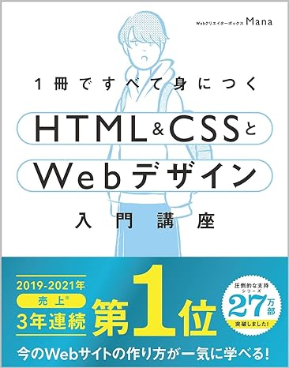

# HTML勉強会

---

## 事前準備

- vscodeをインストールしておいてください
- vscodeの拡張機能に`Live Preview`をインストールしてください

---

## 使用する本

1冊ですべて身につくHTML & CSSとWebデザイン入門講座  

[amazonリンク](https://www.amazon.co.jp/1%E5%86%8A%E3%81%A7%E3%81%99%E3%81%B9%E3%81%A6%E8%BA%AB%E3%81%AB%E3%81%A4%E3%81%8FHTML-CSS%E3%81%A8Web%E3%83%87%E3%82%B6%E3%82%A4%E3%83%B3%E5%85%A5%E9%96%80%E8%AC%9B%E5%BA%A7-Mana/dp/4797398892)

---

## 目的

今まで業務の中でHTMLを書く機会はあったと思いますが、HTMLの構造やルールなどをしっかり理解している人は少ないのではないでしょうか。 {.fragment .fade-up}

今回の勉強会で、HTMLの構造と、基本的なタグについて学んでいきましょう。{.fragment .fade-up}

---

## お題目

- 2-3 HTMLファイルの骨組み {.fragment .fade-right}
- 2-4 HTMLの基本的な書き方 {.fragment .fade-right}
- 2-5~11 代表的なタグ {.fragment .fade-right}
  - 2-5 h1~h6
  - 2-6 p
  - 2-7 img
  - 2-8 a
  - 2-9 ul, ol, li
  - 2-10 table
  - 2-11 form
  - 2-11 input

---

### 2-3 HTMLファイルの骨組み

- htmlタグとは{.fragment .fade-right}
- headタグとは{.fragment .fade-right}
- meta charset="UTF-8とは{.fragment .fade-right}
- titleタグとは{.fragment .fade-right}
- meta name="description" content="とは{.fragment .fade-right}
- bodyタグとは{.fragment .fade-right}
